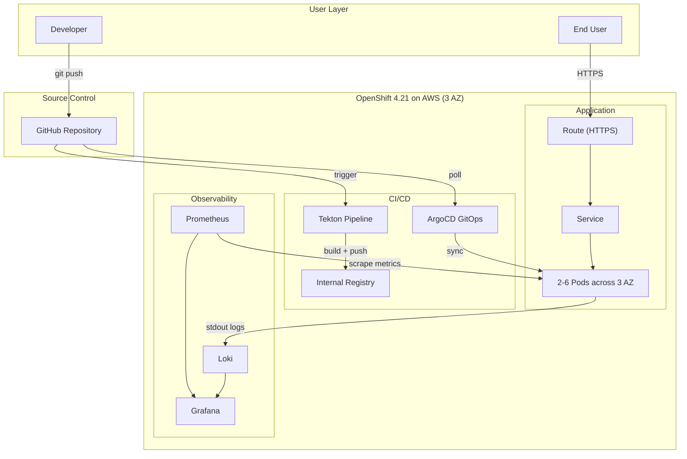

# AI Ticket Intake

An intelligent IT support ticket intake system that uses AI to guide users through issue reporting, automatically classify tickets, and reduce time-to-resolution. Built as an MSPbots product prototype.


## The Problem

Traditional IT ticket forms ask users to fill in category, priority, affected system, etc. — but most users don't know these things. They write vague descriptions like "my computer is acting weird", which leads to:

- Misrouted tickets (wrong team, wrong priority)
- Back-and-forth clarification messages
- Slow resolution times
- Frustrated end users and overloaded support teams

## What This Does

Instead of a dumb form, this system offers **three intake modes** that meet users where they are:

### 1. Free-Text + AI Analysis
Type a description in plain language. AI analyzes it and auto-fills category, subcategory, priority, and summary — with explanations for every decision. Smart suggestion chips appear in real-time as you type, prompting you to add useful details.

### 2. Conversational Chat Mode
Click "Help me describe it" and an AI assistant walks you through 6 guided questions using natural language. Supports both click-to-select options and free-text input. Speech-to-text is available via the browser's Web Speech API.

### 3. Voice Call Mode
Call the AI support agent. It speaks to you (via Edge TTS with 5 accent options), listens via speech recognition, and builds the ticket from your spoken description. Includes an edit step so you can fix any transcription errors before submitting.

## AI Features

| Feature | Description |
|---------|-------------|
| **Auto-Classification** | Maps descriptions to 9 categories and 30+ subcategories |
| **Priority Detection** | Assigns Critical/High/Medium/Low with reasoning |
| **Spell Correction** | Fixes 25+ common IT typos (e.g., "eror" → "error") using Levenshtein distance |
| **Smart Suggestions** | Real-time contextual chips based on 12 trigger rules with priority ranking |
| **Duplicate Detection** | Flags similar open tickets at the same company with similarity scores |
| **Guided Intake** | Multi-step question flows for vague or ambiguous descriptions |
| **Severity Assessment** | Generates severity analysis for performance issues and critical outages |
| **Known Issue Matching** | Links to existing known issues and KCS articles after version upgrades |
| **Status Check** | Detects follow-up inquiries and surfaces existing ticket status |
| **Vague Input Handling** | Recognizes non-technical/emotional descriptions and triggers structured intake |
| **Auto-Escalation** | Critical/Sev1 scenarios trigger automatic escalation with SLA tracking |

## Demo Scenarios

The prototype includes 11 pre-built scenarios covering different use cases:

| Scenario | Trigger | AI Behavior |
|----------|---------|-------------|
| UC1: Error/Crash | "report blew up" | AI-generated structured description, clarifying questions |
| UC2: Can't Log In | "CRM won't let me in" | Guided flow to distinguish credentials vs. permissions vs. system |
| UC3: Performance | "everything is crawling" | Severity assessment, scope clarification |
| UC4: Status Inquiry | "where's my ticket?" | Surfaces existing ticket status, recommends escalation |
| UC5: Vague Input | "computer is acting weird" | Guided intake with 4 structured questions, flagged for manual review |
| UC6: Post-Upgrade | "broke after Salesforce update" | Known issue matching, KCS article suggestions |
| UC7: Deploy Failure | "deployment bombed out" | AI-parsed log analysis, structured breakdown |
| UC8: Access Denied | "permission denied on dashboard" | RBAC-aware guided flow |
| UC9: Multi-Component | "network, storage, monitoring all broken" | Cross-team routing, component breakdown |
| UC10: System Down | "production is completely down" | Auto-Sev1, on-call paging, SLA clock |
| Duplicate | "Outlook keeps crashing" | Duplicate detection with link/separate options |

## Tech Stack

- **Framework**: Next.js 16 (App Router)
- **UI**: React 19 + TailwindCSS 4
- **Language**: TypeScript 5
- **TTS**: Microsoft Edge Neural TTS (via `msedge-tts`)
- **STT**: Web Speech API (Chrome/Edge)
- **Icons**: Lucide React
- **Container**: Multi-stage Docker build (Node 22 Alpine)

## Getting Started

```bash
# Install dependencies
npm install

# Run development server
npm run dev

# Open in browser
open http://localhost:3000
```

### Docker

```bash
docker build -t ai-ticket-intake .
docker run -p 3000:3000 ai-ticket-intake
```

### Run Smart Suggestion Tests

```bash
npm run test:suggestions
```

## Project Structure

```
src/
├── app/
│   ├── page.tsx                 # Main page
│   ├── layout.tsx               # Root layout
│   ├── globals.css              # Global styles + CSS variables
│   ├── api/
│   │   ├── health/route.ts      # Health check endpoint
│   │   └── tts/route.ts         # Text-to-speech API (Edge Neural TTS)
│   └── voice-test/page.tsx      # Standalone mic/speech diagnostic page
├── components/
│   ├── TicketIntake.tsx          # Main intake orchestrator (state machine)
│   ├── ChatIntake.tsx            # Conversational guided intake
│   ├── VoiceCall.tsx             # Voice call with STT + TTS
│   ├── SmartSuggestions.tsx      # Real-time contextual suggestion chips
│   ├── Header.tsx                # App header
│   ├── AIBadge.tsx               # "AI-generated" indicator badge
│   └── TypingIndicator.tsx       # Animated typing dots
├── lib/
│   ├── mock-ai.ts               # AI analysis engine (10 use cases + spell check)
│   └── smart-suggestions.ts     # Rule-based suggestion engine (12 rules + self-tests)
scripts/
└── verify-smart-suggestions.ts  # CLI test runner for suggestion rules
```

## Architecture Notes

- The AI analysis is currently **rule-based simulation** (`mock-ai.ts`) — designed to demonstrate the UX and interaction patterns before integrating a real LLM backend.
- The smart suggestion engine uses **priority-ranked trigger rules** with fallback logic, not keyword matching.
- Voice call implements a **multi-round conversation loop**: speak → edit transcript → AI analyzes → follow-up question → repeat until enough info is collected (max 3 rounds).
- The TTS API uses Edge Neural voices server-side, with browser `SpeechSynthesis` as a fallback.

## Browser Requirements

- **Chrome or Edge** recommended (Web Speech API for speech-to-text)
- Microphone access required for voice features
- Internet required for Chrome's speech recognition (sends audio to Google's servers)

---

## DevOps & Cloud-Native Deployment

This application is deployed on **OpenShift 4.21 (AWS, eu-west-2)** with a full DevOps stack.

### Architecture Overview



### DevOps Stack

| Layer | Technology | Purpose |
|-------|-----------|---------|
| CI | Tekton (OpenShift Pipelines) | Automated build pipeline: clone → build → push image |
| CD | ArgoCD (OpenShift GitOps) | GitOps deployment: Git as single source of truth, auto-sync, self-heal |
| IaC | Kustomize | Base + overlay pattern for dev/prod environment separation |
| Metrics | Prometheus (User Workload Monitoring) | Application metrics collection + alerting |
| Logs | Loki + Cluster Logging | Centralized log aggregation to S3 |
| Dashboard | Grafana | Unified visualization for metrics and logs |
| Registry | OpenShift Internal Registry | S3-backed container image storage |

### High Availability

- **3 AZ deployment**: Pods spread across eu-west-2a/2b/2c via topologySpreadConstraints
- **HPA**: Auto-scale 2-6 replicas based on CPU utilization (target: 70%)
- **PDB**: minAvailable: 1 during node maintenance
- **Health checks**: Liveness + Readiness probes on `/api/health`

### Project Structure

```
├── src/                          # Application source (Next.js 16)
├── Dockerfile                    # Multi-stage build (Node 22 Alpine)
├── deploy/
│   ├── base/                     # Kustomize base manifests
│   ├── overlays/dev/             # Dev environment config
│   ├── overlays/prod/            # Prod environment config
│   ├── argocd/                   # ArgoCD Application definition
│   └── observability/            # ServiceMonitor, PrometheusRule, Grafana
├── ci/
│   ├── tekton/pipeline.yaml      # Tekton CI pipeline
│   └── .gitlab-ci.yml            # Equivalent GitLab CI (reference)
└── docs/
    ├── architecture.md           # Detailed architecture design with diagrams
    └── runbook.md                # Operations runbook
```

### Documentation

- **[Architecture Design](docs/architecture.md)** — Detailed architecture diagrams (CI/CD, monitoring, logging, cluster nodes), technology decisions, HA design
- **[Operations Runbook](docs/runbook.md)** — Troubleshooting guide for common issues, alert handling, rollback procedures
