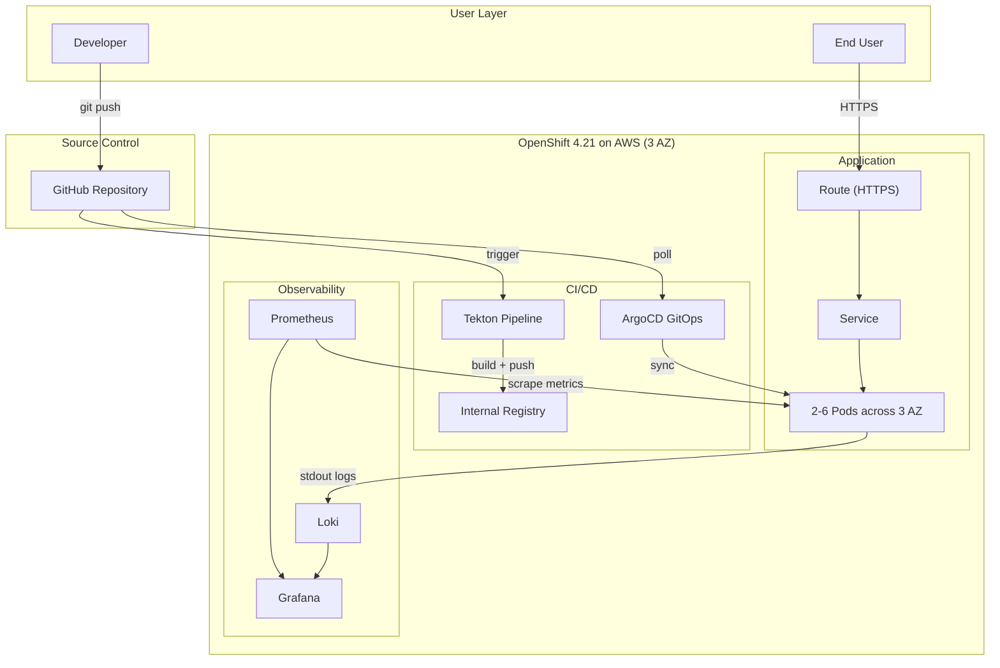

# AI Ticket Intake

An intelligent IT support ticket intake system that uses AI to guide users through issue reporting, automatically classify tickets, and reduce time-to-resolution. Deployed on OpenShift 4.21 (AWS) with a complete cloud-native DevOps stack.


---

## The Problem

Traditional IT ticket forms ask users to fill in category, priority, affected system, etc. — but most users don't know these things. They write vague descriptions like "my computer is acting weird", which leads to:

- Misrouted tickets (wrong team, wrong priority)
- Back-and-forth clarification messages
- Slow resolution times
- Frustrated end users and overloaded support teams

## What This Does

Instead of a dumb form, this system offers **three intake modes** that meet users where they are:

### 1. Free-Text + AI Analysis
Type a description in plain language. AI analyzes it and auto-fills category, subcategory, priority, and summary — with explanations for every decision. Smart suggestion chips appear in real-time as you type, prompting you to add useful details.

### 2. Conversational Chat Mode
Click "Help me describe it" and an AI assistant walks you through 6 guided questions using natural language. Supports both click-to-select options and free-text input. Speech-to-text is available via the browser's Web Speech API.

### 3. Voice Call Mode
Call the AI support agent. It speaks to you (via Edge TTS with 5 accent options), listens via speech recognition, and builds the ticket from your spoken description. Includes an edit step so you can fix any transcription errors before submitting.

## AI Features

| Feature | Description |
|---------|-------------|
| **Auto-Classification** | Maps descriptions to 9 categories and 30+ subcategories |
| **Priority Detection** | Assigns Critical/High/Medium/Low with reasoning |
| **Spell Correction** | Fixes 25+ common IT typos using Levenshtein distance |
| **Smart Suggestions** | Real-time contextual chips based on 12 trigger rules with priority ranking |
| **Duplicate Detection** | Flags similar open tickets with similarity scores |
| **Guided Intake** | Multi-step question flows for vague or ambiguous descriptions |
| **Severity Assessment** | Generates severity analysis for performance issues and critical outages |
| **Known Issue Matching** | Links to existing known issues and KCS articles after version upgrades |
| **Auto-Escalation** | Critical/Sev1 scenarios trigger automatic escalation with SLA tracking |

## Demo Scenarios

The prototype includes 11 pre-built scenarios:

| Scenario | Trigger | AI Behavior |
|----------|---------|-------------|
| Error/Crash | "report blew up" | AI-generated structured description, clarifying questions |
| Can't Log In | "CRM won't let me in" | Guided flow to distinguish credentials vs. permissions |
| Performance | "everything is crawling" | Severity assessment, scope clarification |
| Status Inquiry | "where's my ticket?" | Surfaces existing ticket status |
| Vague Input | "computer is acting weird" | Guided intake with structured questions |
| Post-Upgrade | "broke after Salesforce update" | Known issue matching, KCS article suggestions |
| Deploy Failure | "deployment bombed out" | AI-parsed log analysis |
| System Down | "production is completely down" | Auto-Sev1, on-call paging, SLA clock |

> See **[product-docs/](product-docs/)** for the full PRD, competitor analysis, GTM plan, revenue projections, and prototype videos.

---

## Cloud-Native Deployment

This application is deployed on **OpenShift 4.21 (AWS, eu-west-2, 3 Availability Zones)** with a full DevOps stack.

### Architecture



### DevOps Stack

| Layer | Technology | Purpose |
|-------|-----------|---------|
| Platform | OpenShift 4.21 on AWS (eu-west-2, 3 AZ) | Enterprise Kubernetes with built-in security and operator ecosystem |
| CI | Tekton (OpenShift Pipelines) | Automated build: clone → build → push image |
| CD | ArgoCD (OpenShift GitOps) | GitOps: Git as single source of truth, auto-sync, self-heal |
| IaC | Kustomize | Base + overlay pattern for dev/prod environment separation |
| Metrics | Prometheus (User Workload Monitoring) | Application metrics collection + alerting |
| Logs | Loki + Cluster Logging | Centralized log aggregation to S3 |
| Dashboard | Grafana | Unified visualization for metrics and logs |
| Scaling | HPA | Auto-scale 2-6 replicas at CPU 70% |

### High Availability

- **3 AZ deployment**: Pods spread across eu-west-2a/2b/2c via topologySpreadConstraints
- **HPA**: Auto-scale 2-6 replicas based on CPU utilization
- **PDB**: minAvailable: 1 during node maintenance
- **Health checks**: Liveness + Readiness probes on `/api/health`
- **Rolling updates**: Zero-downtime deployments

> See **[docs/architecture.md](docs/architecture.md)** for detailed diagrams: CI/CD pipeline, monitoring, logging, and cluster node structure.

---

## Project Structure

```
├── src/                          # Application source (Next.js 16, React 19)
├── Dockerfile                    # Multi-stage build (Node 22 Alpine)
├── deploy/
│   ├── base/                     # Kustomize base (Deployment, Service, Route, HPA, PDB)
│   ├── overlays/dev/             # Dev environment (2 replicas, latest tag)
│   ├── overlays/prod/            # Prod environment (3 replicas, stable tag)
│   ├── argocd/                   # ArgoCD Application definition
│   └── observability/            # ServiceMonitor, PrometheusRule, Grafana
├── ci/
│   ├── tekton/pipeline.yaml      # Tekton CI pipeline
│   └── .gitlab-ci.yml            # Equivalent GitLab CI config (reference)
├── docs/
│   ├── architecture.md           # Architecture design with 5 diagrams
│   └── runbook.md                # Operations runbook
└── product-docs/                 # PRD, competitor analysis, GTM plan, prototype videos
```

## Quick Start

```bash
# Local development
npm install && npm run dev

# Container build
docker build -t ai-ticket-intake .
docker run -p 3000:3000 ai-ticket-intake

# Deploy to OpenShift
oc apply -k deploy/overlays/dev/
```

## Documentation

| Document | Description |
|----------|-------------|
| **[Architecture Design](docs/architecture.md)** | CI/CD, monitoring, logging, cluster node diagrams + technology decisions |
| **[Operations Runbook](docs/runbook.md)** | Troubleshooting, alert handling, rollback procedures |
| **[Product Documents](product-docs/)** | PRD, competitor analysis, GTM plan, revenue projections, prototype videos |

## Tech Stack

- **Framework**: Next.js 16 (App Router)
- **UI**: React 19 + TailwindCSS 4
- **Language**: TypeScript 5
- **TTS**: Microsoft Edge Neural TTS (via `msedge-tts`)
- **STT**: Web Speech API (Chrome/Edge)
- **Container**: Multi-stage Docker build (Node 22 Alpine)
- **Platform**: OpenShift 4.21 on AWS
