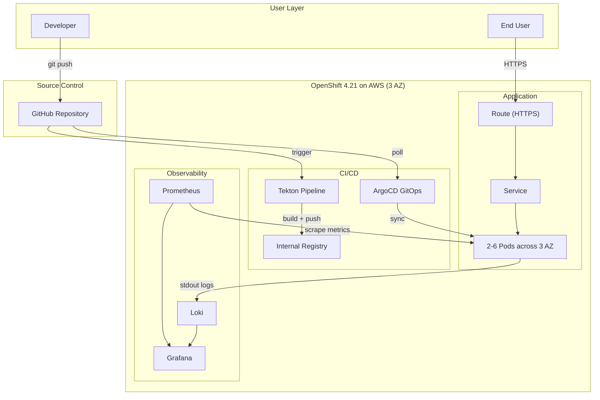

# AI Ticket Intake

An AI-powered IT ticket intake system deployed on **OpenShift 4.21 (AWS)** with a complete DevOps stack: CI/CD (Tekton + ArgoCD), observability (Prometheus + Loki + Grafana), and production-grade high availability across 3 availability zones.


---

## Architecture



> See **[docs/architecture.md](docs/architecture.md)** for detailed diagrams: CI/CD pipeline, monitoring architecture, logging architecture, and cluster node structure.

## DevOps Stack

| Layer | Technology | Purpose |
|-------|-----------|---------|
| Platform | OpenShift 4.21 on AWS (eu-west-2, 3 AZ) | Enterprise Kubernetes with built-in security and operator ecosystem |
| CI | Tekton (OpenShift Pipelines) | Automated build: clone → build → push image |
| CD | ArgoCD (OpenShift GitOps) | GitOps: Git as single source of truth, auto-sync, self-heal, drift detection |
| IaC | Kustomize | Base + overlay pattern for dev/prod environment separation |
| Metrics | Prometheus (User Workload Monitoring) | Application metrics collection + 3 alert rules |
| Logs | Loki + Cluster Logging | Centralized log aggregation to S3 |
| Dashboard | Grafana | Unified visualization for metrics and logs |
| Registry | OpenShift Internal Registry | S3-backed container image storage |
| Scaling | HPA | Auto-scale 2-6 replicas at CPU 70% |

## High Availability

- **3 AZ deployment**: Pods spread across eu-west-2a/2b/2c via topologySpreadConstraints
- **HPA**: Auto-scale 2-6 replicas based on CPU utilization
- **PDB**: minAvailable: 1 during node maintenance
- **Health checks**: Liveness (30s) + Readiness (10s) probes on `/api/health`
- **Rolling updates**: Zero-downtime deployments

---

## The Application

An intelligent IT support ticket intake system that uses AI to guide users through issue reporting, automatically classify tickets, and reduce time-to-resolution.

**Three intake modes:**
1. **Free-Text + AI Analysis** — Type a description, AI auto-classifies category, priority, and generates a structured summary
2. **Conversational Chat** — AI walks you through guided questions using natural language
3. **Voice Call** — Speak to an AI agent with real-time speech-to-text and text-to-speech

**AI capabilities:** Auto-classification (9 categories, 30+ subcategories), priority detection with reasoning, spell correction, smart suggestions, duplicate detection, severity assessment, known issue matching, auto-escalation for critical incidents.

> See **[product-docs/](product-docs/)** for PRD, competitor analysis, GTM plan, revenue projections, and prototype videos.

---

## Project Structure

```
├── src/                          # Application source (Next.js 16, React 19)
├── Dockerfile                    # Multi-stage build (Node 22 Alpine)
├── deploy/
│   ├── base/                     # Kustomize base (Deployment, Service, Route, HPA, PDB)
│   ├── overlays/dev/             # Dev environment (2 replicas, latest tag)
│   ├── overlays/prod/            # Prod environment (3 replicas, stable tag, higher resources)
│   ├── argocd/                   # ArgoCD Application definition
│   └── observability/            # ServiceMonitor, PrometheusRule, Grafana
├── ci/
│   ├── tekton/pipeline.yaml      # Tekton CI pipeline (git-clone → buildah → push)
│   └── .gitlab-ci.yml            # Equivalent GitLab CI config (reference)
├── docs/
│   ├── architecture.md           # Architecture design with 5 diagrams
│   └── runbook.md                # Operations runbook (troubleshooting, rollback, alerts)
└── product-docs/                 # Product documents (PRD, GTM, competitor analysis, videos)
```

## Quick Start

```bash
# Local development
npm install && npm run dev

# Container build
docker build -t ai-ticket-intake .
docker run -p 3000:3000 ai-ticket-intake

# Deploy to OpenShift (via Kustomize)
oc apply -k deploy/overlays/dev/
```

## Documentation

| Document | Description |
|----------|-------------|
| **[Architecture Design](docs/architecture.md)** | CI/CD, monitoring, logging, cluster node diagrams + technology decisions |
| **[Operations Runbook](docs/runbook.md)** | Troubleshooting, alert handling, rollback procedures |
| **[Product Documents](product-docs/)** | PRD, competitor analysis, GTM plan, revenue projections, prototype videos |
