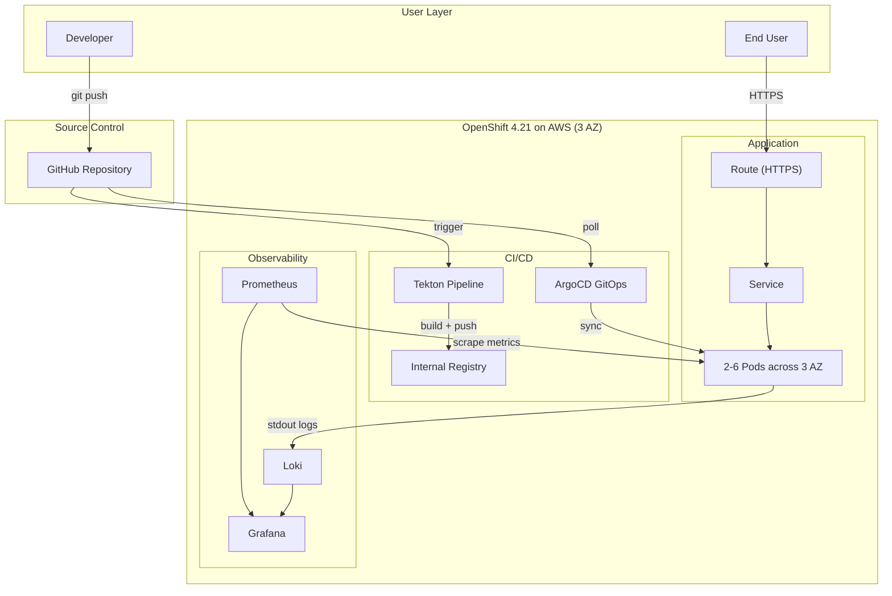

# AI Ticket Intake

An AI-powered IT support ticket intake system that replaces traditional forms with intelligent, guided submission. Users describe their problem in plain language — by typing, chatting, or voice call — and AI handles classification, priority, routing, and quality checks automatically.

Deployed on OpenShift 4.21 (AWS) with a complete cloud-native DevOps stack.


---

## The Problem

Traditional IT ticket forms force users to pick categories, priorities, and affected systems — but most users don't know these things. They write vague descriptions like "my computer is acting weird", leading to misrouted tickets, multiple rounds of clarification, and slow resolution times.

## Three Ways to Submit a Ticket

The system offers three intake modes so users can pick what works for them:

| Mode | How it works | Best for |
|------|-------------|----------|
| **Type it out** | User describes the problem in plain language, AI analyzes and fills in the rest | Users who know what's wrong and want to submit fast |
| **Talk it through (chat)** | AI asks guided questions one at a time, user clicks answers or types short replies | Users who aren't sure how to describe the problem |
| **Call AI support (voice)** | AI speaks to the user (5 accent options), listens via speech recognition, transcript is editable before submission | Users who prefer talking over typing |

## What AI Does

All features below are implemented in the current prototype:

| Feature | What it does |
|---------|-------------|
| **Auto-classification** | Suggests category and subcategory based on the description, with an explanation (e.g. "Routed to Email > Client App because you mentioned Outlook crashing") |
| **Priority detection** | Assigns Critical/High/Medium/Low with reasoning |
| **Structured description generation** | When the user can't describe the problem well, AI generates a structured description an engineer can work with |
| **Spell correction** | Fixes common IT typos (e.g. "netwrok" → "network") using Levenshtein distance, shows what it changed |
| **Smart suggestions** | Real-time contextual chips while typing — if someone types "I don't know which component", a list of common components appears |
| **Missing info detection** | If required context is missing, AI asks specific follow-up questions instead of just saying "fill in all fields" |
| **Guided intake** | For vague descriptions, AI switches to step-by-step questions to collect what's needed |
| **Severity assessment** | For performance complaints, AI tells the user whether it's urgent or can wait |
| **Duplicate detection** | Flags similar open tickets before submission with similarity scores |
| **Existing ticket lookup** | If someone asks "where's my ticket?", AI finds the existing ticket and shows status instead of creating a duplicate |
| **Known issue matching** | After version upgrades, AI cross-references known issues and KCS articles |
| **Log parsing** | For deployment failures with massive logs, AI extracts the key error |
| **Multi-component breakdown** | When a problem spans network, storage, and monitoring, AI separates it into parts for different teams |
| **Auto-escalation** | System down + business impacted = auto Severity 1 + immediate escalation |

All AI suggestions are editable. Nothing gets submitted without the user confirming.

## Demo Scenarios

The prototype includes 10 pre-built scenarios demonstrating different use cases:

| Scenario | Example trigger | What AI does |
|----------|----------------|-------------|
| System error | "report blew up" | Generates structured description, asks clarifying questions |
| Can't log in | "CRM won't let me in" | Guided flow to distinguish credentials vs. permissions vs. system |
| Performance issue | "everything is crawling" | Severity assessment, scope clarification |
| Status inquiry | "where's my ticket?" | Surfaces existing ticket status, recommends escalation |
| Vague input | "computer is acting weird" | Guided intake with structured questions, flagged for manual review |
| Post-upgrade | "broke after Salesforce update" | Known issue matching, KCS article suggestions |
| Deploy failure | "deployment bombed out" | Log parsing, structured breakdown |
| Access denied | "permission denied on dashboard" | RBAC-aware guided flow |
| Multi-component | "network, storage, monitoring all broken" | Cross-team routing, component breakdown |
| System down | "production is completely down" | Auto-Sev1, on-call paging, SLA clock |

> For the full PRD, competitor analysis, GTM plan, and prototype videos, see **[product-docs/](product-docs/)**.

---

## Cloud-Native Deployment

This application is deployed on **OpenShift 4.21 (AWS, eu-west-2)** across 3 Availability Zones with a full DevOps stack.

### Architecture



### DevOps Stack

| Layer | Technology | Purpose |
|-------|-----------|---------|
| Platform | OpenShift 4.21 on AWS (eu-west-2, 3 AZ) | Enterprise Kubernetes |
| CI | Tekton (OpenShift Pipelines) | Automated build: clone → build → push image |
| CD | ArgoCD (OpenShift GitOps) | GitOps: auto-sync, self-heal, drift detection |
| IaC | Kustomize | Base + overlay for dev/prod separation |
| Metrics | Prometheus (User Workload Monitoring) | App metrics + 3 alert rules |
| Logs | Loki + Cluster Logging | Log aggregation to S3 |
| Dashboard | Grafana | Unified metrics + logs visualization |
| Scaling | HPA | Auto-scale 2-6 replicas at CPU 70% |

### High Availability

- **3 AZ deployment**: topologySpreadConstraints across eu-west-2a/2b/2c
- **HPA**: Auto-scale 2-6 replicas based on CPU
- **PDB**: minAvailable: 1 during maintenance
- **Health checks**: Liveness + Readiness probes on `/api/health`

> See **[docs/architecture.md](docs/architecture.md)** for detailed diagrams (CI/CD pipeline, monitoring, logging, cluster nodes) and technology decisions.

---

## Project Structure

```
├── src/                          # Application source (Next.js 16, React 19)
├── Dockerfile                    # Multi-stage build (Node 22 Alpine)
├── deploy/
│   ├── base/                     # Kustomize base (Deployment, Service, Route, HPA, PDB)
│   ├── overlays/dev/             # Dev: 2 replicas, latest tag
│   ├── overlays/prod/            # Prod: 3 replicas, stable tag, higher resources
│   ├── argocd/                   # ArgoCD Application definition
│   └── observability/            # ServiceMonitor, PrometheusRule, Grafana
├── ci/
│   ├── tekton/pipeline.yaml      # Tekton CI pipeline
│   └── .gitlab-ci.yml            # Equivalent GitLab CI (reference)
├── docs/
│   ├── architecture.md           # Architecture design with 5 diagrams
│   └── runbook.md                # Operations runbook
└── product-docs/                 # PRD, competitor analysis, GTM plan, prototype videos
```

## Quick Start

```bash
# Local development
npm install && npm run dev
# Open http://localhost:3000

# Container
docker build -t ai-ticket-intake .
docker run -p 3000:3000 ai-ticket-intake

# Deploy to OpenShift
oc apply -k deploy/overlays/dev/
```

## Documentation

| Document | Description |
|----------|-------------|
| **[Architecture Design](docs/architecture.md)** | CI/CD, monitoring, logging, cluster diagrams + technology decisions |
| **[Operations Runbook](docs/runbook.md)** | Troubleshooting, alert handling, rollback procedures |
| **[Product Documents](product-docs/)** | PRD, competitor analysis, GTM plan, revenue projections, prototype videos |

## Tech Notes

- AI analysis is currently **rule-based simulation** (`mock-ai.ts`) — designed to demonstrate UX patterns before integrating a real LLM backend
- Smart suggestions use **priority-ranked trigger rules** with fallback logic, not keyword matching
- Voice call implements a **multi-round conversation loop**: speak → edit transcript → AI analyzes → follow-up → repeat (max 3 rounds)
- TTS uses Edge Neural voices server-side, with browser SpeechSynthesis as fallback
- **Chrome or Edge** recommended for speech features (Web Speech API)
