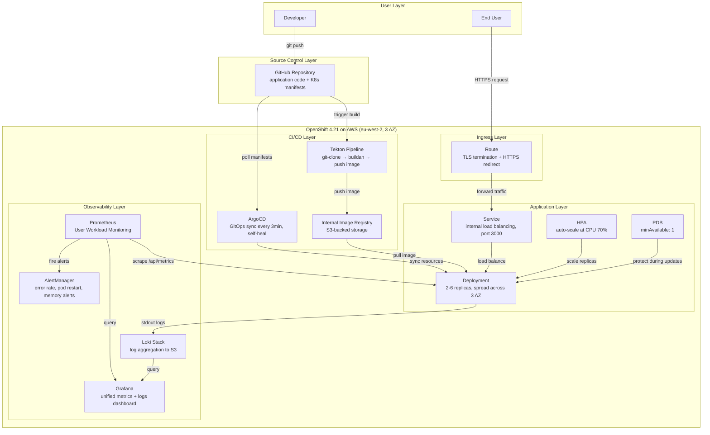
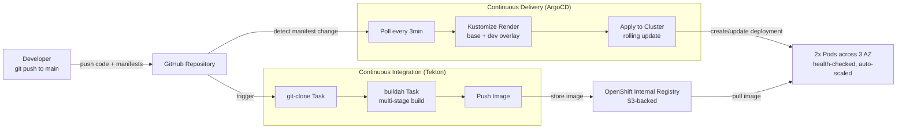
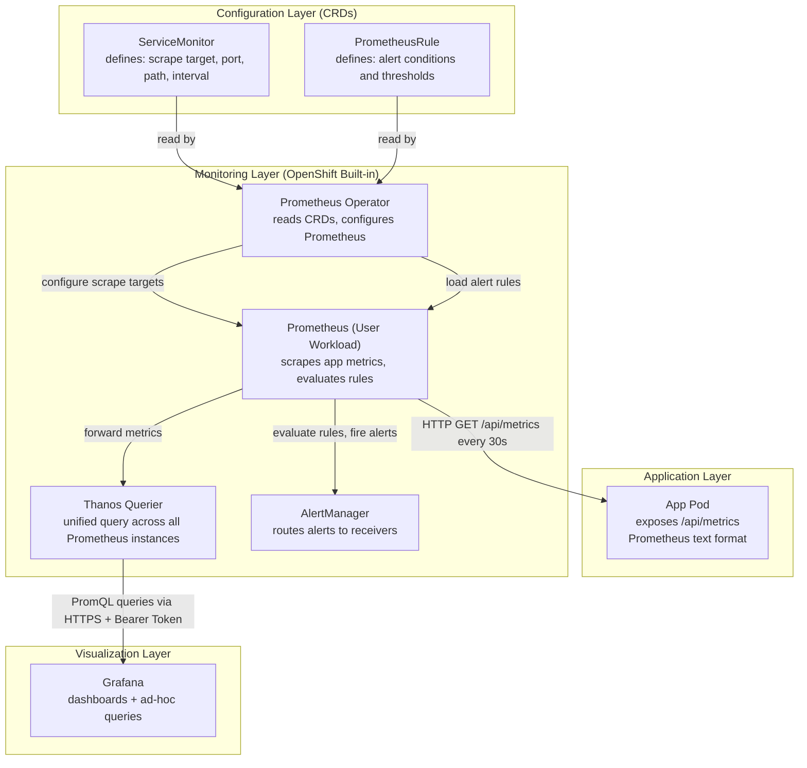
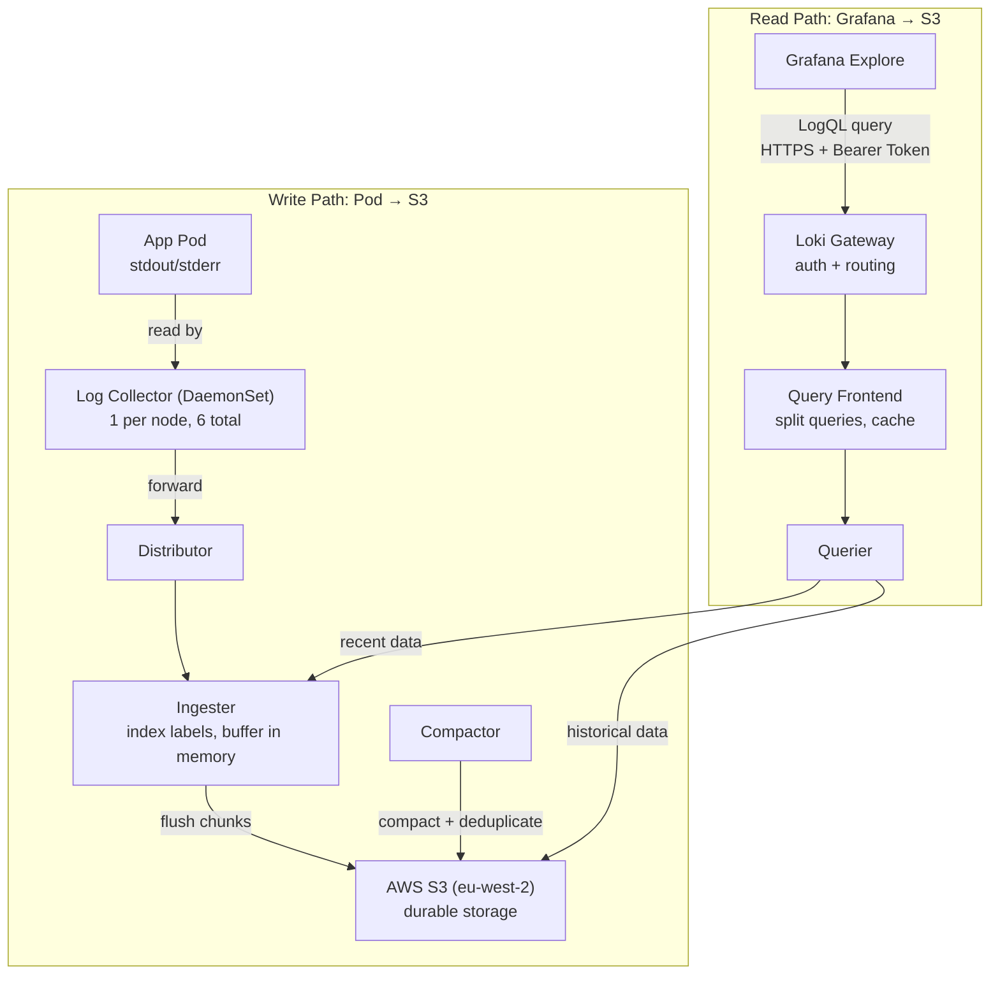
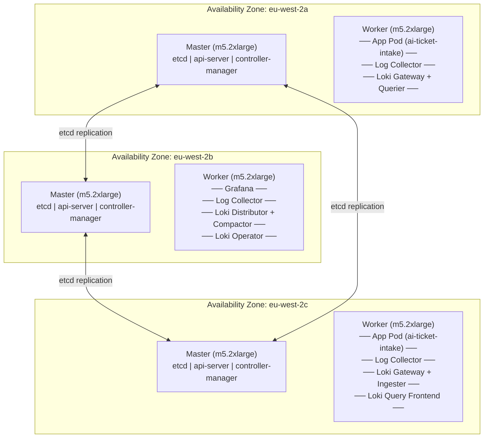

# AI Ticket Intake — Architecture Design

## Overview

This project deploys an AI-powered IT ticket intake system on OpenShift 4.21 (AWS), with a complete DevOps stack: CI/CD pipeline (Tekton + ArgoCD), full observability (Prometheus + Loki + Grafana), and production-grade high availability across 3 availability zones.

## Platform

| Component | Value |
|-----------|-------|
| Cluster | OpenShift 4.21.14 on AWS |
| Region | eu-west-2 (London), 3 Availability Zones |
| Nodes | 3 control-plane + 3 worker (m5.2xlarge) |
| Container Runtime | CRI-O |
| Storage | gp3-csi (EBS) |
| Ingress | OpenShift Router (HAProxy) |

---

## 1. Overall Architecture — Layered View



---

## 2. CI/CD Pipeline — Stage View



**How it works:**

1. Developer pushes code to GitHub
2. Tekton Pipeline triggers: clones the repo, builds a container image using buildah, pushes to OpenShift's internal image registry
3. ArgoCD polls the Git repo every 3 minutes, detects changes in `deploy/overlays/dev/`, and syncs the new configuration to the cluster
4. OpenShift performs a rolling update with zero downtime

**Key design decisions:**

| Decision | Rationale |
|----------|-----------|
| Tekton over Jenkins | Kubernetes-native, no separate CI server to maintain. Each build step runs as a Pod. |
| ArgoCD for GitOps | Git is the single source of truth. Manual cluster changes are automatically reverted (self-heal). Rollback = `git revert`. |
| Kustomize over Helm | Simpler for this use case. Base + overlay pattern cleanly separates dev/prod configuration without templating complexity. |
| Internal Registry over DockerHub | Cluster-native, no external credentials needed. Images stay within the cluster network. |

---

## 3. Monitoring Architecture — Data Flow View



**Alert rules defined:**

| Alert | Condition | Severity |
|-------|-----------|----------|
| HighErrorRate | Error rate > 5% over 5 minutes | Warning |
| PodRestarting | Any Pod restart in 15 minutes | Warning |
| HighMemoryUsage | Memory > 85% of limit | Warning |

**Why User Workload Monitoring instead of a separate Prometheus?**
- Zero additional infrastructure to maintain
- Leverages OpenShift's existing monitoring stack
- Prometheus Operator handles configuration, upgrades, and scaling automatically

---

## 4. Logging Architecture — Data Flow View



**Why Loki over Elasticsearch?**
- Much lower resource usage (indexes only labels, not full text)
- S3 as storage backend: cheap, unlimited capacity, no cluster to manage
- Native Grafana integration: same UI for metrics and logs
- Operator-managed: install via OperatorHub, upgrade automatically

---

## 5. Cluster Node Structure — Physical View



**Key observations:**
- Application Pods are spread across AZ-a and AZ-c (topologySpreadConstraints enforced)
- Log Collectors run on every worker node (DaemonSet)
- Loki components are distributed across all 3 workers for resilience
- Each AZ has one master + one worker, tolerating a single AZ failure

---

## Technology Selection

| Layer | Technology | Why |
|-------|-----------|-----|
| Container Platform | OpenShift 4.21 (K8s 1.34) | Enterprise K8s with built-in security, monitoring, and operator ecosystem |
| CI | Tekton (OpenShift Pipelines) | K8s-native, no external CI server needed |
| CD | ArgoCD (OpenShift GitOps) | GitOps model, declarative, drift detection, easy rollback |
| IaC | Kustomize | Base + overlay pattern for environment separation |
| Metrics | Prometheus (User Workload Monitoring) | Built into OpenShift, zero additional infra |
| Logs | Loki (Loki Operator) | Lightweight, S3-backed, Grafana-native |
| Dashboard | Grafana | Unified visualization for metrics and logs |
| Image Registry | OpenShift Internal Registry | Cluster-native, no external registry needed |
| Auto-scaling | HPA | CPU-based horizontal scaling |
| Container Build | Buildah | Daemonless, rootless builds inside K8s |

---

## High Availability Design

| Mechanism | Configuration | Purpose |
|-----------|---------------|---------|
| Multi-AZ deployment | topologySpreadConstraints, maxSkew: 1 | Pods spread across availability zones; one AZ failure does not take down the service |
| HPA | min: 2, max: 6, CPU target: 70% | Automatic scaling based on load |
| PDB | minAvailable: 1 | At least 1 Pod always running during node maintenance or rolling updates |
| Rolling update | Default strategy | New Pods start before old ones terminate |
| Health checks | Liveness (30s) + Readiness (10s) on /api/health | Unhealthy Pods restarted or removed from load balancing |
| etcd replication | 3 masters across 3 AZ | Control plane survives single AZ failure |

---

## Security Considerations

| Aspect | Implementation |
|--------|---------------|
| Non-root container | `USER 1001` in Dockerfile, OpenShift SCC enforced |
| TLS everywhere | Route terminates TLS (edge), HTTP redirect to HTTPS |
| RBAC | Least-privilege ServiceAccounts (system:image-builder for pipeline, cluster-monitoring-view for Grafana) |
| Image provenance | Images built in-cluster via Tekton, stored in internal registry |
| GitOps audit trail | All deployment changes tracked in Git history |

---

## Project Structure

```
ai-ticket-intake/
├── src/                          # Application source code (Next.js 16)
├── Dockerfile                    # Multi-stage build (Node 22 Alpine)
├── deploy/
│   ├── base/                     # Kustomize base (shared config)
│   │   ├── deployment.yaml       # Pod spec, probes, resources, topology
│   │   ├── service.yaml          # ClusterIP service, port 3000
│   │   ├── route.yaml            # TLS edge termination
│   │   ├── hpa.yaml              # CPU-based auto-scaling
│   │   ├── pdb.yaml              # Disruption budget
│   │   └── kustomization.yaml    # Resource list
│   ├── overlays/
│   │   ├── dev/                  # Dev: 2 replicas, latest tag
│   │   └── prod/                 # Prod: 3 replicas, stable tag, higher resources
│   ├── argocd/                   # ArgoCD Application definition
│   └── observability/            # ServiceMonitor, PrometheusRule, Grafana
├── ci/
│   ├── tekton/pipeline.yaml      # Tekton CI pipeline definition
│   └── .gitlab-ci.yml            # Equivalent GitLab CI config (reference)
└── docs/
    ├── architecture.md           # This document
    ├── implementation-guide.md   # Step-by-step setup guide
    └── runbook.md                # Operations runbook
```
